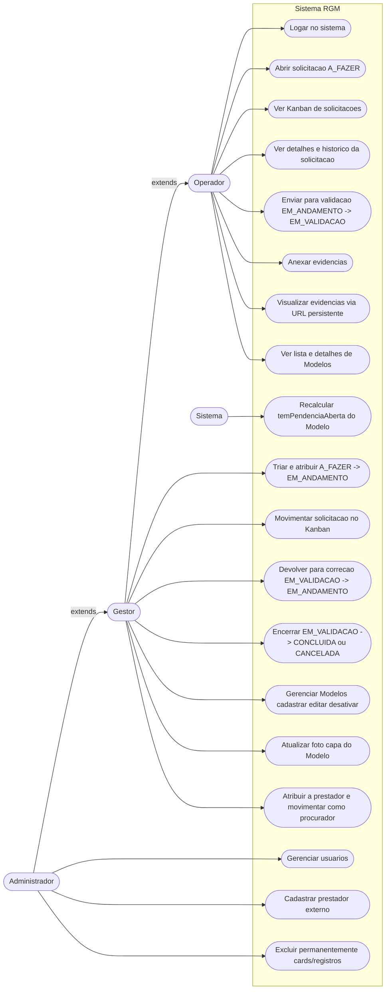
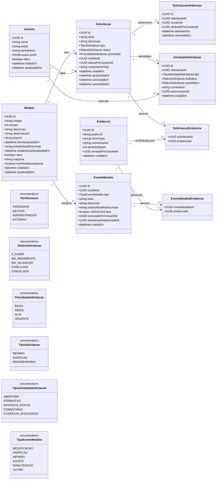
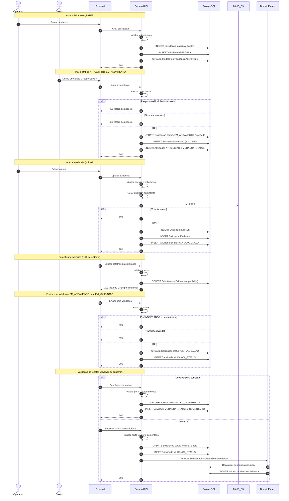
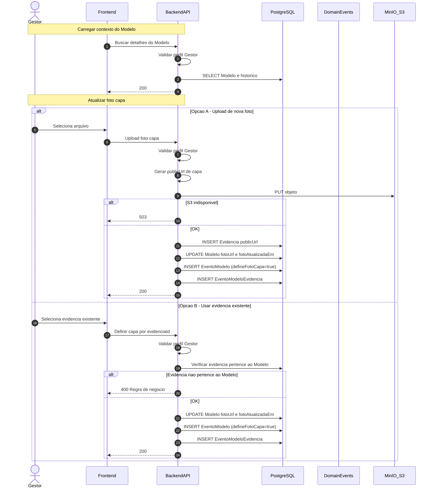
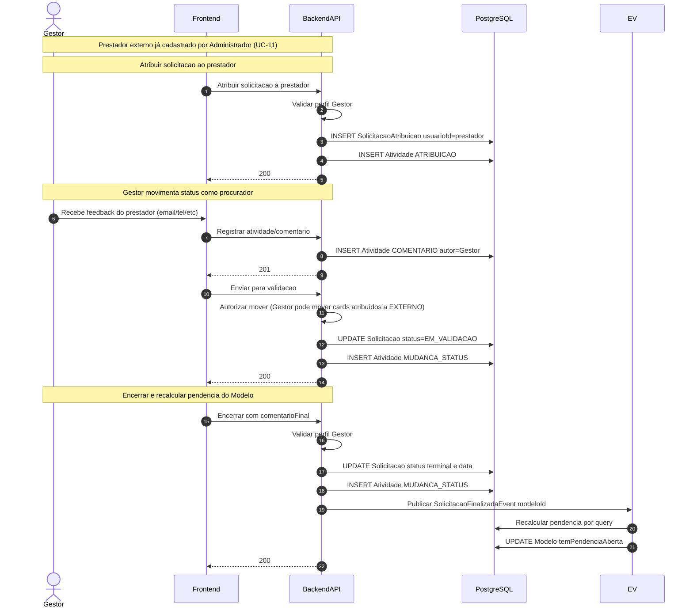
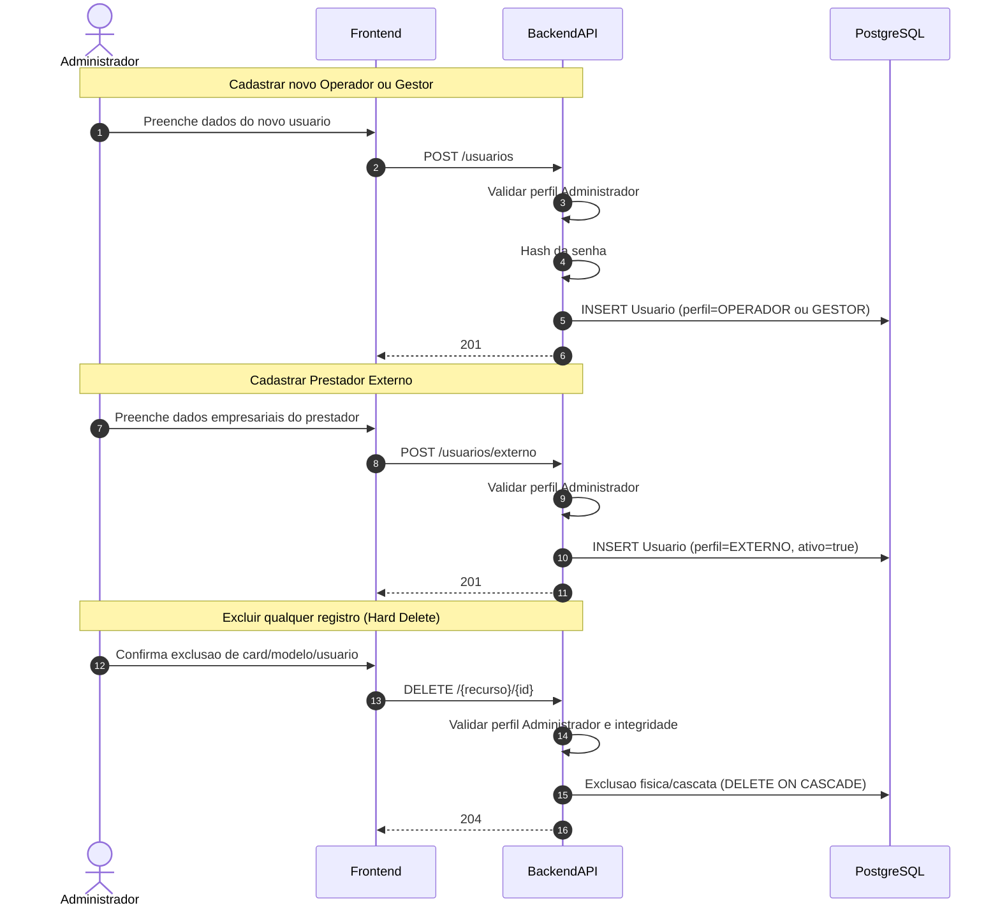

# Diagramas

Este arquivo reúne os diagramas principais (casos de uso, classes e sequência) e está alinhado com:

- RBAC com distinção entre **mover** (controle) e **executar** (atribuição)
- Perfil **EXTERNO** para prestadores de serviço (apenas para atribuição e histórico)
- Evidências em bucket público (MinIO/S3) usando URLs persistentes (sem expiração)
- Recalculo de `Modelo.temPendenciaAberta` via evento/listener ao atingir estado terminal
- Foto capa do Modelo (`fotoUrl`) atualizável por Gestor (e Administrador por herança) (upload novo ou reaproveitar evidência existente)
- Prestador externo representado como um Usuário no sistema (Gestor atua como seu procurador para movimentações)

## Casos de uso (completo)

## Diagrama de classes (completo)

## Sequencia 1: Solicitacao e evidencias (MinIO) com consistencia de pendencia

Este diagrama cobre RBAC (mover vs executar), evidencias via bucket público (URL persistente) e recalculo de `temPendenciaAberta` via evento.

## Sequencia 2: Atualizar foto capa do Modelo (upload ou evidencias existentes)

## Sequencia 3: Terceirizar servico (prestador externo) e gestor como procurador

## Sequencia 4: Administracao (Geral e Deleção Avançada)

Este fluxo isola as funcoes exclusivas do Perfil Administrador (invisível em atribuicoes da aplicacao), incluindo exclusões completas para o painel administrativo.

